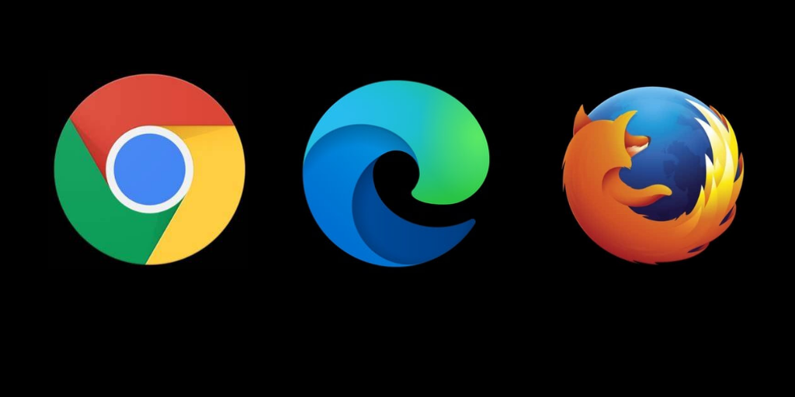

<html lang="en">
<head>
    <meta charset="UTF-8">
    <meta name="viewport" content="width=device-width, initial-scale=1.0">
    <title>Some of the best keyboard shortcuts</title>
    
</head>
<body bgcolor="black">
    
    
    

        <h1>Some of the best keyboard shortcuts</h1>
    

    
<h1>Windows 10

    
    
All Browsers</h1>
    

    
.

.

.

.

.

.

.

    <legend>this image magnification script was taken from a stackoverflow<a href="https://pt.stackoverflow.com/users/71206/pedro-souza"> link user in his stackoverflow</a></legend>

</body>
</html>
